<a href="#about">About</a> &nbsp; / &nbsp; <a href="#toolbox">Toolbox</a> &nbsp; / &nbsp; <a href="#repositories">Repositories</a> &nbsp; / &nbsp; <a href="#activity">Activity</a> &nbsp; / &nbsp; <a href="https://ashifrza.github.io/ASHIFRZA/">Play Commit Dash ↗</a>

### About

More about what I do

I work across React and Next.js interfaces, Node.js and Flask APIs, and MongoDB/MySQL data layers. My projects explore AI-assisted tools, image generation and classification, stock-news sentiment, and web applications people can use.

At Syntechxhub I worked on responsive layouts, translating design mockups into frontend components, debugging browser issues, and integrating REST APIs. My mathematics background shapes how I approach problems and learn new systems.

My current public GitHub bio lists **HireEdge**, an AI interview preparation platform, as my focus. The cards below link to repositories that are currently public.

### Toolbox

### Repositories

<table>
<tr><td></td><td></td></tr>
<tr><td></td><td></td></tr>
</table>

[Try Keystro](https://keystro-gamma.vercel.app) · [See all public repositories](https://github.com/ashifrza?tab=repositories)

### Activity

  

### Arcade

[Launch game ↗](https://ashifrza.github.io/ASHIFRZA/) · [Read the game source](./game)

 

**Have something worth building?**

[Portfolio](https://www.ashifrza.in/) · [LinkedIn](https://www.linkedin.com/in/ashifrza/) · [Email](mailto:ashifrza18@gmail.com)

<samp>ASHIF RZA / CODE. BUILD. PLAY.</samp>

