<h3><code>ashifrza@github ~ $ ./contributions.sh</code></h3>

  

<h3><code>ashifrza@github ~ $ whoami</code></h3>
<table>
  <tr>
    <td valign="top"></td>
    <td valign="top"></td>
  </tr>
</table>

 

<h3><code>ashifrza@github ~ $ ./links.sh</code></h3>

  <a href="https://www.ashifrza.in/">Portfolio</a> &nbsp;&middot;&nbsp;
  <a href="https://www.linkedin.com/in/ashifrza/">LinkedIn</a> &nbsp;&middot;&nbsp;
  <a href="mailto:ashifrza18@gmail.com">Email</a>

<samp>React interfaces. Node.js APIs. AI-powered applications.</samp>

